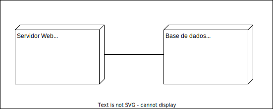

# Documento Visão - Programa de Votos

Histórico da Revisão
| Data | Versão | Descrição | Autor |
|------------|-------|--------------------------------------------|------------|
| 13/09/2023 | 1.0.0 | Pedido de hospedagem para a DTI | pauloh.pires e paulo.sermann |

## 1. Definição do problema

### 1.1. Cenário atual

Cada processo analisado de aposentadoria leva em média duas à quatro horas para ser analisado pelo conselheiro. Esse tempo denota um tempo de mais ou menos 50% à 60% na elaboração da redação final.

Ao elaborar um despacho, os Conselheiros usam arquivos modelo, onde, para cada decisão, eles registram textos que são sempre os mesmos. Para repetir esses textos eles usam outros arquivos nos quais têm registrados os textos padrão de cada decisão, copiam e colam em no despacho final.

Todo esse processo é muito demorado e o texto final tem pouca variância em relação aos textos padrão.

### 1.2. Objetivo de negócio

* Reduzir o tempo de trabalho na coleta de textos base
* Redução do tempo de elaboração dos votos
* Padronizar a redação de acórdãos
* Padronizar a fundamentação jurídica

### 1.3. Métricas de sucesso

* Aumentar em 30% a quantidade de processos julgados por mês

## 2. Descrição da Solução

Frente ao tempo dedicado pelos Conselheiros em formatar o documento e em escrever os textos que são basicamente sempre os mesmos, o Conselho de Recurso idealizou uma solução na qual o Conselheiro forneça os parâmetros de cada decisão e suas variáveis e o sistema retorne um despacho formatado, o qual ainda pode ser editado pelo Conselheiro caso deseje adaptar algo que varie para o caso específico

## 3. Escopo e limitações

### 3.1. Contexto do sistema

### 3.2. Features principais

* Geração de relatório a partir das respostas de um formulário
* Editor de formulário
* Copiar o texto do relatório

### 3.3. Escopo das próximas releases
* Login do Gestor do Formulário
* Gestão de usuários Gestores do Formulário
* Permite criar vários formulários
* Exportar para formato Word (doc)
* Plugin para questões que trazem dados dos sistemas corporativos

### 3.4. Limitações e exclusões

* Está fora deste projeto integrações com sistemas corporativos. Essa integração deverá ser realizada por plugin quando desenvolvida essa funcionalidade

## 4. Contexto de negócio

### 4.1. Perfil dos interessados

| Cargo de negócio | Papel no sistema | Usuário do sistema | Representante |
|-------|-----------|--------------------|---------------|
| Presidente do CRPS |  |não |Ana Cristina Silveira|
| Conselheiro do CRPS | Gestor do Formulário |sim |Paulo Vitor Nazário|
| Conselheiros do CRPS | Conselheiro |sim | - |

# 5. Diagrama de Instalação

